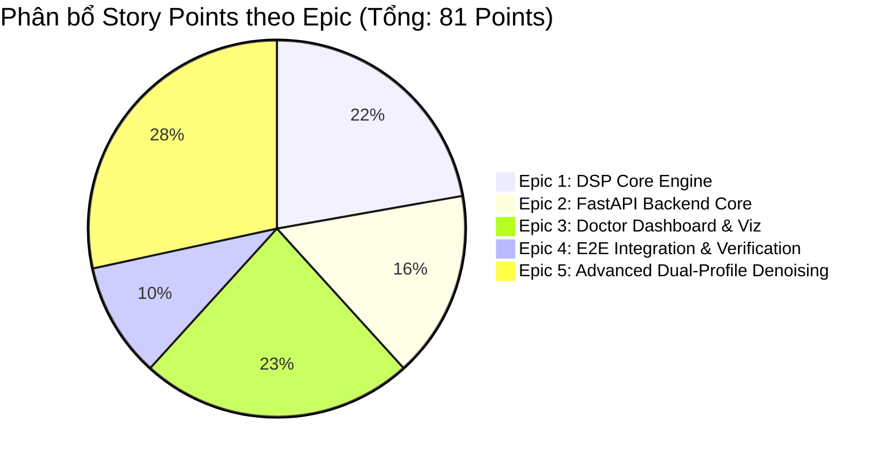

# DANH SÁCH EPICS VÀ USER STORIES
## Dự án: Ứng Dụng Xử Lý Tín Hiệu & AI Trong Khử Nhiễu & Trực Quan Hóa Âm Thanh Hô Hấp
> **Tài liệu nguồn:** [PROJECT_EXECUTION_PLAN.md](file:///d:/Slide_THPT/PhanDangKhanh_AI/respiratory-sound-denoising-viz/docs/PROJECT_EXECUTION_PLAN.md)  
> **Quản lý trạng thái:** `sprint-status.yaml`  
> **Tiêu chuẩn:** Agile / Scrum, Gherkin Acceptance Criteria (Given - When - Then)  

---

## TỔNG QUAN PHÂN BỔ EPICS

| Epic ID | Tên Epic | Số Stories | Story Points | Ưu tiên | Trạng thái Mục tiêu |
|---|---|:---:|:---:|:---:|---|
| **EPIC-1** | Lõi Xử Lý Tín Hiệu DSP & Thuật Toán Khử Nhiễu | 6 | 18 | P0 (Critical) | Sprint 1 (Hoàn thành) |
| **EPIC-2** | Dịch Vụ Backend FastAPI & Tầng Dữ Liệu Y Tế | 7 | 13 | P0 (Critical) | Sprint 2 (Hoàn thành) |
| **EPIC-3** | Bảng Điều Khiển Bác Sĩ & Trực Quan Hóa Âm Học | 7 | 19 | P0 (Critical) | Sprint 3 (Hoàn thành) |
| **EPIC-4** | Tích Hợp E2E, Thẩm Định Y Tế & Đóng Gói | 4 | 8 | P1 (High) | Sprint 4 (Hoàn thành) |
| **EPIC-5** | Nghiên Cứu Chuyên Sâu & Tối Ưu Hóa Khử Nhiễu Đa Miền (Dual Profile) | 6 | 23 | P0 (Critical) | Sprint 5 (Sắp triển khai) |

---

## CHI TIẾT CÁC EPICS VÀ USER STORIES

---

### 🟢 EPIC 1: LÕI XỬ LÝ TÍN HIỆU DSP & THUẬT TOÁN KHỬ NHIỄU (DSP CORE ENGINE)
**Mục tiêu:** Xây dựng module Python thuần (`scipy`, `numpy`, `soundfile`) thực hiện toàn bộ pipeline tiền xử lý, lọc dải thông Zero-phase, cắt khoảng lặng VAD và triệt tiêu tiếng ồn thích ứng với độ trễ < 800ms cho file 15s.

#### Story 1.1: Audio Ingestion, Mono Conversion & 16kHz Resampling
- **Key:** `1-1-audio-ingestion-resampling`
- **Story Points:** 2 | **Ưu tiên:** P0
- **Mô tả:** Là một kỹ sư DSP, tôi muốn chuyển đổi mọi định dạng âm thanh đầu vào (.wav, .mp3) về tệp chuẩn WAV PCM 16-bit, đơn kênh (Mono) với tần số lấy mẫu cố định 16,000 Hz và chuẩn hóa biên độ RMS.
- **Tiêu chí chấp nhận (AC):**
  - **Given:** Một tệp âm thanh bất kỳ (stereo/mono, sample rate 44.1kHz hoặc 48kHz).
  - **When:** Chạy qua hàm `ingest_audio(file_bytes_or_path)`.
  - **Then:** Trả về NumPy array 1D (float32), sample rate chính xác bằng 16,000 Hz, biên độ chuẩn hóa trong khoảng `[-1.0, 1.0]`.

#### Story 1.2: Zero-Phase Butterworth Bandpass Filter (50Hz - 4000Hz)
- **Key:** `1-2-zero-phase-bandpass-filter`
- **Story Points:** 3 | **Ưu tiên:** P0
- **Mô tả:** Là một kỹ sư DSP, tôi muốn áp dụng bộ lọc dải thông IIR Butterworth bậc 4 từ 50Hz đến 4000Hz bằng kỹ thuật lọc hai chiều (`sosfiltfilt`) để loại bỏ tạp âm siêu trầm (<50Hz) và nhiễu tần số cao mà không làm lệch pha sóng âm.
- **Tiêu chí chấp nhận (AC):**
  - **Given:** Mảng tín hiệu âm thanh 16kHz đã chuẩn hóa.
  - **When:** Áp dụng bộ lọc `apply_bandpass_filter(signal, lowcut=50, highcut=4000, sr=16000)`.
  - **Then:** Tín hiệu ngoài dải 50-4000Hz bị suy giảm tối thiểu -24dB/octave, độ lệch pha (Phase Delay) bằng 0 (Zero-phase distortion).

#### Story 1.3: Acoustic Energy & Entropy VAD Engine
- **Key:** `1-3-acoustic-vad-engine`
- **Story Points:** 4 | **Ưu tiên:** P0
- **Mô tả:** Là một kỹ sư DSP, tôi muốn phát hiện chính xác các khoảng lặng không chứa âm thanh hô hấp dựa trên năng lượng cục bộ (RMS) kết hợp Spectral Flatness, đồng thời bổ sung khoảng đệm an toàn (Padding 150ms trước và 200ms sau) để không bao giờ cắt cụt chu kỳ thở của bệnh nhân.
- **Tiêu chí chấp nhận (AC):**
  - **Given:** Tín hiệu âm thanh hô hấp có các đoạn im lặng kéo dài > 1 giây.
  - **When:** Chạy qua thuật toán `detect_and_trim_silence(signal, sr=16000)`.
  - **Then:** Cắt bỏ >90% khoảng lặng tĩnh, tỷ lệ cắt nhầm âm thanh hô hấp (False Rejection Rate) < 1.0%, mỗi đoạn hô hấp được bảo tồn vùng đệm tối thiểu 150ms trước và 200ms sau.

#### Story 1.4: Adaptive Spectral Gating Denoising
- **Key:** `1-4-adaptive-spectral-gating`
- **Story Points:** 4 | **Ưu tiên:** P0
- **Mô tả:** Là một kỹ sư DSP, tôi muốn triệt tiêu tạp âm nền liên tục (quạt gió, điều hòa, tiếng ồn phòng khám) bằng thuật toán Spectral Gating phi tuyến tính trên miền tần số STFT mà không gây ra hiện tượng méo âm "nhạc nước" (musical artifacts).
- **Tiêu chí chấp nhận (AC):**
  - **Given:** Bản ghi âm hô hấp có tạp âm nền (SNR ban đầu từ 0dB đến 10dB).
  - **When:** Thực thi `reduce_noise_spectral_gating(signal, sr=16000)`.
  - **Then:** Chỉ số SNR cải thiện $\Delta\text{SNR} \ge +8\text{ dB}$, bảo toàn nguyên vẹn tần số formant của tiếng ran rít (Wheeze: 200-1000Hz) và ran nổ (Crackle).

#### Story 1.5: Decibel Mel-Spectrogram Matrix Generator
- **Key:** `1-5-decibel-mel-spectrogram`
- **Story Points:** 2 | **Ưu tiên:** P0
- **Mô tả:** Là một lập trình viên backend, tôi muốn tính toán ma trận phổ tần Mel-scale Decibel từ tín hiệu âm thanh và đóng gói dưới dạng mảng 2D (JSON/Float32Array) kèm trục thời gian và tần số để phục vụ vẽ đồ thị ở frontend.
- **Tiêu chí chấp nhận (AC):**
  - **Given:** Tín hiệu âm thanh sạch sau lọc nhiễu.
  - **When:** Gọi `generate_mel_spectrogram(signal, n_mels=128, fmin=50, fmax=4000)`.
  - **Then:** Trả về dictionary chứa `{ time_axis: [...], freq_axis: [...], mel_db_matrix: [[...]] }`, giá trị dB chuẩn hóa từ -80dB đến 0dB.

#### Story 1.6: DSP Quality Benchmark Harness (SNR & Distortion)
- **Key:** `1-6-dsp-quality-benchmark`
- **Story Points:** 3 | **Ưu tiên:** P1
- **Mô tả:** Là một chuyên viên QA, tôi muốn có bộ script kiểm chuẩn tự động đo lường $\Delta\text{SNR}$, Log-Spectral Distance (LSD) và thời gian thực thi của toàn bộ pipeline trên tập dữ liệu mẫu chuẩn y tế.
- **Tiêu chí chấp nhận (AC):**
  - **Given:** Thư mục chứa 4 file âm thanh chuẩn kiểm thử (Normal, Wheeze, Crackle, Noisy).
  - **When:** Chạy `python -m pytest tests/test_benchmark.py`.
  - **Then:** Xuất bảng báo cáo: Thời gian chạy trung bình < 800ms/file 15s, $\Delta\text{SNR} \ge +8\text{ dB}$, LSD < 1.5 dB, tất cả assertions đều PASS.

---

### 🔵 EPIC 2: DỊCH VỤ BACKEND FASTAPI & TẦNG DỮ LIỆU Y TẾ (FASTAPI BACKEND & DATA LAYER)
**Mục tiêu:** Xây dựng hệ thống REST API hoàn chỉnh, phi tập trung với FastAPI, lưu trữ SQLite cho metadata/ghi chú, cung cấp API stream âm thanh và dữ liệu trực quan hóa phổ tần.

#### Story 2.1: FastAPI App Initialization & Storage Architecture
- **Key:** `2-1-fastapi-initialization-storage`
- **Story Points:** 1 | **Ưu tiên:** P0
- **Mô tả:** Là một lập trình viên backend, tôi muốn khởi tạo ứng dụng FastAPI với cấu trúc module chuẩn, cấu hình CORS, xử lý ngoại lệ toàn cục và tạo tự động các thư mục lưu trữ `/storage/raw/`, `/storage/cleaned/`, `/storage/presets/`.
- **Tiêu chí chấp nhận (AC):**
  - **Given:** Ứng dụng backend được khởi động qua `uvicorn app.main:app`.
  - **When:** Gửi request `GET /api/health`.
  - **Then:** Trả về HTTP 200 `{ "status": "healthy", "version": "1.0.0" }`, các thư mục lưu trữ tồn tại đầy đủ trên đĩa cứng.

#### Story 2.2: SQLite Database & Schema Definition
- **Key:** `2-2-sqlite-database-schema`
- **Story Points:** 2 | **Ưu tiên:** P0
- **Mô tả:** Là một lập trình viên backend, tôi muốn thiết lập cơ sở dữ liệu SQLite `metadata.db` với bảng `audio_records` và bảng `annotations`, hỗ trợ quan hệ 1-N và cascade delete.
- **Tiêu chí chấp nhận (AC):**
  - **Given:** Khởi chạy server lần đầu.
  - **When:** Kết nối vào database SQLite.
  - **Then:** Bảng `audio_records` và `annotations` được tự động tạo với đúng schema (các trường id, paths, snr_delta, timestamps, tags, clinical_notes).

#### Story 2.3: Audio Ingestion & Validation API (`POST /api/audio/upload`)
- **Key:** `2-3-audio-upload-validation-api`
- **Story Points:** 2 | **Ưu tiên:** P0
- **Mô tả:** Là một người dùng, tôi muốn tải lên tệp âm thanh (.wav, .mp3) dung lượng tối đa 10MB để hệ thống kiểm tra tính hợp lệ và lưu vào thư mục `raw/`.
- **Tiêu chí chấp nhận (AC):**
  - **Given:** Tệp âm thanh từ client gửi qua multipart/form-data.
  - **When:** Gửi tới `POST /api/audio/upload`.
  - **Then:** Nếu hợp lệ, trả về HTTP 201 kèm `{ audio_id, filename, duration, size }`. Nếu file > 10MB hoặc sai định dạng, trả về HTTP 400 kèm thông báo lỗi rõ ràng.

#### Story 2.4: Denoising Pipeline Orchestration API (`POST /api/audio/process/{id}`)
- **Key:** `2-4-denoising-process-api`
- **Story Points:** 3 | **Ưu tiên:** P0
- **Mô tả:** Là một người dùng, tôi muốn kích hoạt pipeline làm sạch âm thanh cho bản ghi đã tải lên để nhận lại đường dẫn file sạch cùng các chỉ số cải thiện chất lượng.
- **Tiêu chí chấp nhận (AC):**
  - **Given:** Một `audio_id` hợp lệ trong hệ thống.
  - **When:** Gửi `POST /api/audio/process/{audio_id}`.
  - **Then:** Pipeline DSP xử lý hoàn tất trong < 1.2 giây, lưu file sạch vào `storage/cleaned/`, cập nhật chỉ số SNR vào SQLite và trả về JSON chứa metadata kết quả.

#### Story 2.5: Spectrogram Data & Audio Streaming Endpoints
- **Key:** `2-5-spectrogram-audio-streaming-api`
- **Story Points:** 2 | **Ưu tiên:** P0
- **Mô tả:** Là một lập trình viên frontend, tôi muốn có API lấy dữ liệu ma trận phổ Mel và API stream file âm thanh trực tiếp (gốc hoặc sạch) để phát trên trình duyệt.
- **Tiêu chí chấp nhận (AC):**
  - **Given:** Bản ghi âm đã được xử lý.
  - **When:** Gọi `GET /api/audio/spectrogram/{id}` và `GET /api/audio/stream/{id}/cleaned`.
  - **Then:** Endpoint phổ trả về ma trận Decibel JSON đầy đủ; Endpoint stream trả về `audio/wav` hỗ trợ HTTP Range Requests để tua âm thanh mượt mà.

#### Story 2.6: Medical Annotations CRUD API (`/api/annotations`)
- **Key:** `2-6-medical-annotations-crud-api`
- **Story Points:** 2 | **Ưu tiên:** P0
- **Mô tả:** Là một bác sĩ, tôi muốn lưu trữ, xem danh sách và xóa các ghi chú y khoa gắn với từng khoảng thời gian của bản ghi âm.
- **Tiêu chí chấp nhận (AC):**
  - **Given:** Một đoạn bôi đen từ `start_time` đến `end_time` kèm `tag` và `clinical_note`.
  - **When:** Gửi request tới `POST /api/annotations`, `GET /api/annotations/{audio_id}`, `DELETE /api/annotations/{annotation_id}`.
  - **Then:** Dữ liệu được lưu và phản hồi chuẩn xác theo định dạng JSON với mã trạng thái HTTP tương ứng.

#### Story 2.7: Preset Clinical Audio Loader API (`GET /api/presets`)
- **Key:** `2-7-preset-clinical-audio-loader`
- **Story Points:** 1 | **Ưu tiên:** P1
- **Mô tả:** Là một người dùng thử nghiệm / bác sĩ, tôi muốn có danh sách các ca bệnh mẫu có sẵn để tải nhanh và trải nghiệm hệ thống ngay lập tức mà không cần tự thu âm.
- **Tiêu chí chấp nhận (AC):**
  - **Given:** 4 file mẫu chuẩn có sẵn trong `storage/presets/`.
  - **When:** Gửi request `GET /api/presets`.
  - **Then:** Trả về danh sách 4 ca bệnh: Tiếng thở bình thường, Tiếng hen phế quản (Wheeze), Viêm phổi (Crackle), Tiếng ho có đờm kèm mô tả lâm sàng.

---

### 🟣 EPIC 3: BẢNG ĐIỀU KHIỂN BÁC SĨ & TRỰC QUAN HÓA ÂM HỌC (DOCTOR DASHBOARD & VISUALIZATION)
**Mục tiêu:** Xây dựng giao diện web React + Vite hiện đại, Dark theme y tế, tích hợp Web Audio API, Wavesurfer v7 với công tắc Toggle A/B 0ms, Canvas Mel-spectrogram Magma và bảng gán nhãn Take-note.

#### Story 3.1: React + Vite Workspace & Medical Dark UI Shell
- **Key:** `3-1-react-vite-ui-shell`
- **Story Points:** 2 | **Ưu tiên:** P0
- **Mô tả:** Là một lập trình viên frontend, tôi muốn khởi tạo ứng dụng React với Vite, thiết lập bảng màu Dark theme y tế sang trọng (nền Slate đậm, accent Cyan/Emerald, glassmorphism card), responsive layout cho desktop và tablet.
- **Tiêu chí chấp nhận (AC):**
  - **Given:** Khởi chạy `npm run dev`.
  - **When:** Mở trình duyệt tại `http://localhost:5173`.
  - **Then:** Hiển thị Dashboard hoàn chỉnh với Header, Control Bar, Visualization Area và Annotation Sidebar; giao diện tải lần đầu < 1.8s.

#### Story 3.2: Raw Web Audio Recording Studio (No Hardware Filter)
- **Key:** `3-2-raw-web-audio-recording`
- **Story Points:** 3 | **Ưu tiên:** P0
- **Mô tả:** Là một người dùng / bác sĩ, tôi muốn ghi âm trực tiếp qua microphone với Web Audio API được cấu hình tắt toàn bộ bộ lọc phần cứng (echoCancellation, noiseSuppression, autoGainControl) để giữ nguyên âm học bệnh lý, kèm đồng hồ đếm ngược và thanh đo âm lượng (VU meter).
- **Tiêu chí chấp nhận (AC):**
  - **Given:** Người dùng bấm nút "Bắt đầu Thu âm".
  - **When:** Cho phép quyền truy cập Micro.
  - **Then:** Trình duyệt thu âm đúng chuẩn 1 kênh không lọc ồn phần cứng; thanh VU meter hiển thị biên độ sóng thời gian thực; cho phép dừng và tải lên server trong 1 click.

#### Story 3.3: Dual-Synchronized Wavesurfer Audio Player
- **Key:** `3-3-dual-synchronized-wavesurfer`
- **Story Points:** 3 | **Ưu tiên:** P0
- **Mô tả:** Là một bác sĩ, tôi muốn nhìn thấy dạng sóng (Waveform) của cả bản thu gốc và bản thu đã làm sạch hiển thị đồng bộ, cho phép click để tua tới bất kỳ vị trí nào trên bản ghi.
- **Tiêu chí chấp nhận (AC):**
  - **Given:** Bản ghi âm đã được nạp vào trình duyệt.
  - **When:** Bấm Play hoặc click vào một điểm trên sóng âm.
  - **Then:** Thanh Playhead di chuyển mượt mà trên cả 2 bản ghi, thời gian hiển thị chính xác từng phần mười giây (00:00.0).

#### Story 3.4: Instant A/B Toggle Controller (0ms Delay)
- **Key:** `3-4-instant-ab-toggle-controller`
- **Story Points:** 2 | **Ưu tiên:** P0
- **Mô tả:** Là một bác sĩ, tôi muốn chuyển đổi tức thì giữa việc nghe "Bản gốc" và "Bản đã làm sạch" bằng phím tắt `Tab` hoặc nút Toggle mà âm thanh không bị ngắt quãng hay giật lag.
- **Tiêu chí chấp nhận (AC):**
  - **Given:** Âm thanh đang được phát.
  - **When:** Bác sĩ nhấn phím `Tab` hoặc click nút chuyển đổi A/B.
  - **Then:** Kênh âm thanh hoán đổi ngay lập tức (độ trễ 0ms), Playhead tiếp tục chạy liên tục, nhãn trạng thái hiển thị rõ ràng: `[ĐANG NGHE: ĐÃ KHỬ NHIỄU]` hoặc `[ĐANG NGHE: BẢN GỐC]`.

#### Story 3.5: Canvas Interactive Mel-Spectrogram Viewer (Magma Colormap)
- **Key:** `3-5-canvas-interactive-mel-spectrogram`
- **Story Points:** 4 | **Ưu tiên:** P0
- **Mô tả:** Là một bác sĩ, tôi muốn quan sát phổ tần số Mel-spectrogram được vẽ mượt mà trên HTML5 Canvas bằng dải màu `Magma`, hiển thị rõ trục Tần số (50Hz - 4000Hz) và trục Thời gian, đồng thời có vạch Playhead chạy đồng bộ với audio.
- **Tiêu chí chấp nhận (AC):**
  - **Given:** Ma trận Decibel trả về từ backend.
  - **When:** Render lên Canvas component.
  - **Then:** Biểu đồ hiển thị sắc nét trong < 15ms; các dải tần số bất thường (ran rít/nổ) tương phản rõ rệt; vạch thời gian di chuyển khớp 100% với Waveform bên trên.

#### Story 3.6: Medical Region Selector & Quick-Tag Annotation Panel
- **Key:** `3-6-medical-region-take-note`
- **Story Points:** 3 | **Ưu tiên:** P0
- **Mô tả:** Là một bác sĩ, tôi muốn dùng chuột kéo chọn một khoảng thời gian bất thường trên phổ tần, chọn nhanh thẻ bệnh lý (`Wheeze`, `Crackle`, `Rhonchi`, `Stridor`, `Wet Cough`, `Artifact`) và nhập ghi chú để lưu lại hồ sơ.
- **Tiêu chí chấp nhận (AC):**
  - **Given:** Vùng phổ tần hiển thị trên màn hình.
  - **When:** Bác sĩ kéo chuột chọn khoảng từ giây thứ $t_1$ đến $t_2$.
  - **Then:** Vùng chọn được highlight; popup hiển thị 6 Quick-Tags; khi lưu, ghi chú được gửi tới backend và hiển thị một marker cố định trên dòng thời gian.

#### Story 3.7: Preset Patient Selector & Export Summary
- **Key:** `3-7-preset-selector-export-summary`
- **Story Points:** 2 | **Ưu tiên:** P1
- **Mô tả:** Là một bác sĩ / giám khảo, tôi muốn chọn nhanh 4 ca bệnh mẫu từ thanh công cụ và có nút xuất báo cáo tóm tắt ca bệnh (chứa thông tin bản ghi, chỉ số $\Delta\text{SNR}$, biểu đồ và danh sách ghi chú).
- **Tiêu chí chấp nhận (AC):**
  - **Given:** Dashboard đang hiển thị một ca bệnh.
  - **When:** Bấm nút "Xuất Báo Cáo Y Khoa".
  - **Then:** Hệ thống tạo bản in / PDF tóm tắt chứa thông tin định danh ca bệnh, chỉ số cải thiện tạp âm và toàn bộ các đoạn take-note của bác sĩ.

---

### 🟡 EPIC 4: TÍCH HỢP E2E, THẨM ĐỊNH Y TẾ & ĐÓNG GÓI (E2E INTEGRATION & PACKAGING)
**Mục tiêu:** Kiểm thử toàn diện hành trình người dùng, tối ưu hóa hiệu năng tổng thể, lập báo cáo chỉ số y tế và đóng gói script chạy một chạm.

#### Story 4.1: End-to-End User Flow Integration Testing
- **Key:** `4-1-e2e-user-flow-testing`
- **Story Points:** 3 | **Ưu tiên:** P0
- **Mô tả:** Là một chuyên viên QA, tôi muốn kiểm thử tự động và thủ công toàn bộ luồng sử dụng: Thu âm/Upload $\to$ Xử lý $\to$ Xem phổ $\to$ Nghe A/B $\to$ Take-note $\to$ Xuất kết quả để đảm bảo không có bất kỳ lỗi vỡ giao diện hay nghẽn dữ liệu.
- **Tiêu chí chấp nhận (AC):**
  - **Given:** Hệ thống backend và frontend đang chạy.
  - **When:** Người dùng thực hiện liên tục toàn bộ kịch bản sử dụng.
  - **Then:** 100% các bước hoàn thành trơn tru, không có lỗi console 4xx/5xx, dữ liệu lưu đồng bộ vào SQLite.

#### Story 4.2: Latency & Performance Optimization Profiling
- **Key:** `4-2-latency-performance-profiling`
- **Story Points:** 2 | **Ưu tiên:** P0
- **Mô tả:** Là một System Architect, tôi muốn đo lường và tối ưu hóa độ trễ: Backend pipeline xử lý file 15s < 1.2s, thời gian phản hồi API < 200ms, Canvas vẽ phổ đạt 60 FPS.
- **Tiêu chí chấp nhận (AC):**
  - **Given:** Tải 5 request xử lý đồng thời.
  - **When:** Chạy profiling đo lường thời gian đáp ứng.
  - **Then:** Trung bình thời gian xử lý toàn trình $\le 1.2\text{s}$, bộ nhớ RAM server tiêu thụ $\le 300\text{MB}$.

#### Story 4.3: Clinical Metric Report & Technical Documentation
- **Key:** `4-3-clinical-metric-report`
- **Story Points:** 2 | **Ưu tiên:** P1
- **Mô tả:** Là một Technical Writer, tôi muốn tổng hợp số liệu đo đạc thực tế ($\Delta\text{SNR}$, PESQ, VAD accuracy) trên các ca bệnh mẫu và lập tài liệu báo cáo kỹ thuật hoàn chỉnh.
- **Tiêu chí chấp nhận (AC):**
  - **Given:** Dữ liệu benchmark sau khi chạy test suite.
  - **When:** Biên soạn tài liệu `docs/CLINICAL_BENCHMARK_REPORT.md`.
  - **Then:** Tài liệu có đầy đủ bảng biểu so sánh trước/sau, ảnh chụp phổ minh họa các ca bệnh hen phế quản/viêm phổi và phân tích kết quả âm học.

#### Story 4.4: One-Click Startup Script & Deployment Packaging
- **Key:** `4-4-one-click-startup-packaging`
- **Story Points:** 1 | **Ưu tiên:** P1
- **Mô tả:** Là một người dùng / giám khảo chấm thi, tôi muốn có script khởi chạy dự án bằng 1 click (`start.bat` trên Windows) để tự động khởi động cả FastAPI backend và Vite frontend mà không cần gõ lệnh phức tạp.
- **Tiêu chí chấp nhận (AC):**
  - **Given:** Máy tính có cài đặt Python 3.10+ và NodeJS 18+.
  - **When:** Người dùng nhấp đúp vào `start.bat`.
  - **Then:** Cả Backend (port 8000) và Frontend (port 5173) tự động khởi động và trình duyệt tự động mở trang web ứng dụng.

---

### 🟣 EPIC 5: NGHIÊN CỨU CHUYÊN SÂU & TỐI ƯU HÓA KHỬ NHIỄU ĐA MIỀN (ADVANCED DUAL-PROFILE DENOISING ENGINE)
**Mục tiêu:** Nâng cấp hệ thống từ lọc DSP đơn lẻ lên kiến trúc đa thuật toán Pluggable Engine, hỗ trợ **Dual Audio Profile (Tiếng phổi & Tiếng nói)**, tích hợp mô hình Deep Learning thời gian thực qua ONNX Runtime (< 35ms trên CPU) và thuật toán sinh học bóc tách tiếng tim đập.
> **Tài liệu nghiên cứu cơ sở:** [ADVANCED_DENOISING_RESEARCH.md](file:///d:/Slide_THPT/PhanDangKhanh_AI/respiratory-sound-denoising-viz/docs/ADVANCED_DENOISING_RESEARCH.md)

#### Story 5.1: Dual-Domain Acoustic Research Whitepaper
- **Key:** `5-1-dual-domain-acoustic-whitepaper`
- **Story Points:** 3 | **Ưu tiên:** P0
- **Mô tả:** Là một Technical Writer & Nghiên cứu sinh AI, tôi muốn tài liệu hóa toàn diện cơ sở toán học của các thuật toán DSP & Deep Learning (DTLN, DCCRN, Wave-U-Net, WPT, EMD), lập ma trận so sánh đối sánh âm học giữa Tiếng phổi và Tiếng nói, và xác lập bộ chỉ số y tế chuẩn xác (CPR, WHF, HSAI).
- **Tiêu chí chấp nhận (AC):**
  - **Given:** Yêu cầu nghiên cứu sâu về thuật toán khử nhiễu đa miền âm học.
  - **When:** Xuất bản tài liệu `docs/ADVANCED_DENOISING_RESEARCH.md`.
  - **Then:** Tài liệu gồm tối thiểu 6 chương, có sơ đồ Mermaid chi tiết, công thức toán LaTeX đầy đủ, ma trận so sánh các thuật toán và phân tích sự khác biệt giữa hai profile `respiratory` vs `speech`.

#### Story 5.2: Dual Audio Profile Schema & Strategy Pattern Engine
- **Key:** `5-2-dual-profile-strategy-pattern-engine`
- **Story Points:** 4 | **Ưu tiên:** P0
- **Mô tả:** Là một System Architect, tôi muốn thiết kế kiến trúc Strategy Pattern cho `backend/app/engine/` với lớp trừu tượng `BaseDenoisingEngine` và cấu hình Pydantic `AudioProfileConfig` hỗ trợ hai profile: `respiratory` (50–2500Hz, bảo tồn rale) và `speech` (80–7500Hz, tối ưu âm rõ nét), cho phép cắm rút thuật toán linh hoạt qua API query/body.
- **Tiêu chí chấp nhận (AC):**
  - **Given:** API endpoint `/api/audio/process` nhận thêm tham số `profile: Literal["respiratory", "speech"]` và `algorithm: str`.
  - **When:** Gửi request xử lý với profile tương ứng.
  - **Then:** Hệ thống tự động kích hoạt bộ tham số lọc thông dải, ngưỡng VAD và hệ số triệt tiêu phù hợp; code cũ (default profile) hoạt động bình thường 100% không bị breaking change.

#### Story 5.3: Biological Heart Sound & Friction Suppression Module
- **Key:** `5-3-bio-acoustic-heart-sound-filter`
- **Story Points:** 4 | **Ưu tiên:** P1
- **Mô tả:** Là một kỹ sư DSP, tôi muốn xây dựng module lọc sinh học dựa trên Wavelet Packet Transform (WPT) và phân tích năng lượng dải tần số 20Hz – 150Hz để làm sạch tiếng tim đập (Heart Sounds S1/S2) và tiếng cọ xát ống nghe mà không làm suy hao âm phế nang ở đáy phổi.
- **Tiêu chí chấp nhận (AC):**
  - **Given:** Bản ghi âm thanh hô hấp có tạp âm tiếng tim đập rõ rệt chèn vào thì thở.
  - **When:** Áp dụng engine `bio_acoustic` với `profile="respiratory"`.
  - **Then:** Chỉ số suy giảm tiếng tim $\text{HSAI} \ge 10\text{ dB}$, bảo tồn $\ge 90\%$ năng lượng âm thở phế nang, không sinh nhiễu nhân tạo.

#### Story 5.4: Real-time DTLN Deep Learning Engine via ONNX Runtime
- **Key:** `5-4-realtime-deep-learning-onnx-engine`
- **Story Points:** 5 | **Ưu tiên:** P0
- **Mô tả:** Là một kỹ sư AI, tôi muốn tích hợp mô hình học sâu thời gian thực DTLN (Dual-Signal Transformation LSTM) được lượng hóa và đóng gói định dạng ONNX (`dtln_denoiser.onnx`), nạp qua ONNX Runtime CPU để đạt khả năng khử nhiễu sâu ($\Delta\text{SNR} \ge +12\text{ dB}$) với độ trễ suy luận $< 35\text{ms}$.
- **Tiêu chí chấp nhận (AC):**
  - **Given:** File âm thanh 15 giây đầu vào.
  - **When:** Xử lý bằng `dtln_ai` engine.
  - **Then:** Thời gian suy luận mô hình trên CPU $\le 35\text{ms}$, $\Delta\text{SNR} \ge +12\text{ dB}$, PESQ cải thiện $\ge +0.8$ điểm, RAM tiêu thụ thêm $< 50\text{MB}$.

#### Story 5.5: Multi-Metric Clinical & Speech Quality Benchmark Suite
- **Key:** `5-5-clinical-speech-benchmark-suite`
- **Story Points:** 4 | **Ưu tiên:** P1
- **Mô tả:** Là một Test Architect, tôi muốn mở rộng module `metrics.py` và test suite để tính toán tự động cả chỉ số âm học tiếng nói (PESQ, STOI, SDR, LSD) lẫn chỉ số âm học phổi độc quyền (CPR - Crackle Preservation Rate, WHF - Wheeze Harmonic Fidelity), phục vụ đánh giá A/B khách quan giữa các engine.
- **Tiêu chí chấp nhận (AC):**
  - **Given:** Cặp tín hiệu âm thanh trước và sau xử lý của cả hai profile `respiratory` và `speech`.
  - **When:** Chạy hàm `evaluate_comprehensive_benchmark(raw, clean, sr, profile)`.
  - **Then:** Trả về dictionary đầy đủ các chỉ số tương ứng theo đúng profile; 100% test cases trong `tests/test_benchmark.py` pass.

#### Story 5.6: Multi-Algorithm & Dual Profile Selector UI
- **Key:** `5-6-multi-algorithm-dual-profile-ui`
- **Story Points:** 3 | **Ưu tiên:** P1
- **Mô tả:** Là một bác sĩ / chuyên gia âm học, tôi muốn trên thanh công cụ của Dashboard có nút chuyển nhanh giữa **Chế độ Phổi (🫁 Respiratory)** và **Chế độ Tiếng nói (🎙️ Speech)**, kèm theo dropdown chọn thuật toán (`Classical DSP`, `Deep AI DTLN`, `Bio-Acoustic Heart Filter`) để trực tiếp trải nghiệm và đối chiếu A/B trên biểu đồ Mel-Spectrogram.
- **Tiêu chí chấp nhận (AC):**
  - **Given:** Người dùng mở giao diện Dashboard.
  - **When:** Chọn thay đổi Profile hoặc Algorithm trên thanh điều khiển.
  - **Then:** Trạng thái gửi request lên backend thay đổi tức thì, kết quả Waveform, Spectrogram và MetricsCard cập nhật đồng bộ các chỉ số tương ứng mà không cần reload trang.

