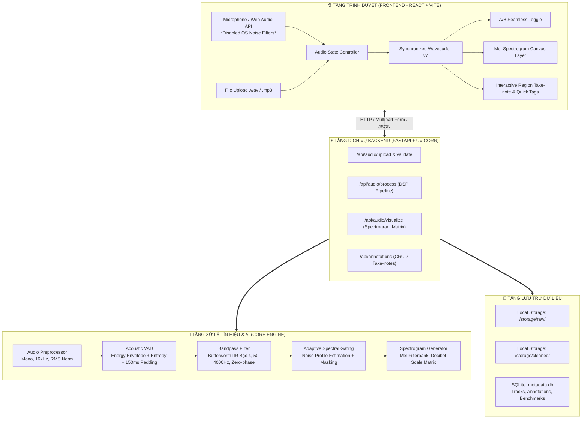
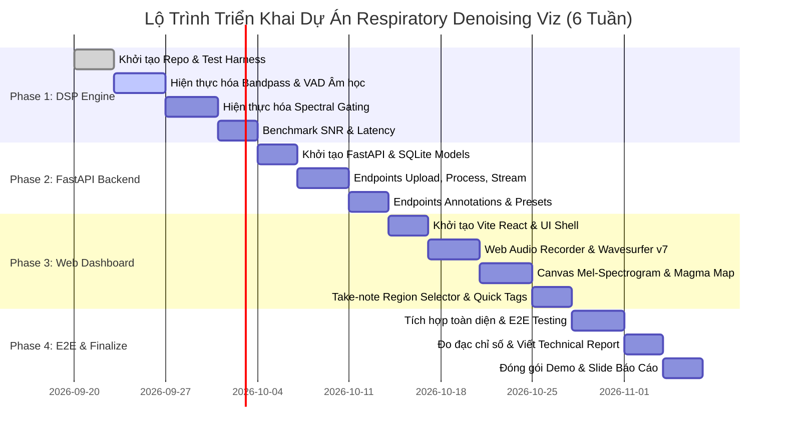

# KẾ HOẠCH TRIỂN KHAI DỰ ÁN (PROJECT EXECUTION PLAN)
## Ứng Dụng Công Nghệ Xử Lý Tín Hiệu & AI Trong Khử Nhiễu & Trực Quan Hóa Âm Thanh Hô Hấp
> **Phiên bản:** 1.0.0  
> **Ngày phê duyệt:** 2026-09-19  
> **Chủ trì thẩm định:** Hội đồng Chuyên gia BMAD (Winston, Amelia, Freya, Murat)  
> **Chủ nhiệm dự án:** Tony  

---

## 1. TỔNG QUAN DỰ ÁN & MỤC TIÊU CHIẾN LƯỢC

### 1.1. Bối cảnh & Vấn đề Cốt lõi
Âm thanh hô hấp (tiếng thở, tiếng rít khí phế quản, ran nổ, tiếng ho) thu nhận tại phòng khám hoặc qua thiết bị di động thường xuyên bị suy giảm chất lượng nghiêm trọng do:
- **Tạp âm môi trường:** Tiếng quạt gió, tiếng nói chuyện, tiếng ồn thiết bị y tế xung quanh (White/Pink noise, Ambient babble).
- **Nhiễu cơ học:** Tiếng cọ xát của ống nghe/microphone vào quần áo người bệnh (Friction artifacts).
- **Khoảng lặng vô ích:** Các khoảng ngừng thở kéo dài làm phân tán sự tập trung của bác sĩ lâm sàng.

### 1.2. Giải pháp Đề xuất
Xây dựng một nền tảng Web thông minh đóng vai trò **Trợ lý Tiền xử lý Y khoa** với 3 trụ cột:
1. **Pipeline DSP & AI Hybrid:** Làm sạch âm thanh tự động, cắt bỏ khoảng lặng, lọc dải thông và triệt tiêu tiếng ồn nền mà **bảo toàn tuyệt đối các đặc trưng âm học bệnh lý**.
2. **Dashboard Đối sánh & Trực quan hóa Đồng bộ:** Trình phát âm thanh chuyển đổi A/B tức thời không độ trễ, kết hợp biểu đồ Waveform và Mel-spectrogram tối ưu thị giác y khoa.
3. **Medical Take-note System:** Công cụ gán nhãn, bôi đậm vùng bất thường trên phổ tần và xuất báo cáo ca bệnh chuẩn xác.

---

## 2. CHỈ SỐ THÀNH CÔNG & TIÊU CHUẨN KIỂM CHUẨN (QUALITY GATES)

| STT | Tiêu chí | Metric / KPI Cụ thể | Phương pháp Đo lường & Ngưỡng chấp nhận |
|---|---|---|---|
| **1** | **Thời gian xử lý Pipeline** | `< 1.2 giây` cho file 15 giây | Đo thời gian chạy từ lúc nhận file đến khi trả JSON kết quả (trên CPU chuẩn). |
| **2** | **Cải thiện Tỷ số Tín hiệu/Nhiễu** | `ΔSNR ≥ +8 dB đến +14 dB` | So sánh SNR trước và sau xử lý trên tập kiểm thử nhiễu nền chuẩn. |
| **3** | **Bảo toàn Đặc trưng Bệnh lý** | `PESQ ≥ 3.2` và `LSD < 1.5 dB` | Đo biến dạng phổ (Log-Spectral Distance) dải tần số 100Hz - 2000Hz (Ran rít/nổ). |
| **4** | **Độ tin cậy của VAD** | `FRR < 1.0%`, `FAR < 10%` | False Rejection Rate (cắt nhầm tiếng thở) < 1.0%; Cắt bỏ >90% khoảng lặng tĩnh. |
| **5** | **Độ trễ Frontend (FCP)** | `FCP < 1.8 giây` | Thời gian tải trang ban đầu của Dashboard trên trình duyệt web. |
| **6** | **Chuyển đổi Audio A/B** | `Switching Delay = 0ms` | Crossfade mượt mà giữa Original và Denoised mà không dừng/lệch Playhead. |

---

## 3. KIẾN TRÚC HỆ THỐNG TOÀN DIỆN (SYSTEM ARCHITECTURE)



---

## 4. CHI TIẾT THUẬT TOÁN DSP & AI DENOISING PIPELINE

### 4.1. Tiền xử lý Chuẩn hóa (Audio Ingestion)
- Chuyển đổi định dạng nguồn về tệp WAV PCM 16-bit.
- Ép kiểu kênh: **Single-channel (Mono)**.
- Tần số lấy mẫu: **16,000 Hz** (Tần số Nyquist $f_N = 8,000$ Hz, bao phủ hoàn toàn dải thông tin bệnh học của hô hấp).
- Chuẩn hóa biên độ năng lượng đỉnh: $x_{norm} = \frac{x}{\max(|x|) + \epsilon}$.

### 4.2. Bộ lọc dải thông Zero-phase (Bandpass Filtering)
- **Dải tần thông qua:** $50 \text{ Hz} - 4,000 \text{ Hz}$.
- **Bộ lọc:** Butterworth IIR bậc 4.
- **Kỹ thuật chống lệch pha:** Sử dụng `scipy.signal.sosfiltfilt` để lọc tiến-lùi (forward-backward filtering). Đảm bảo waveform không bị trượt thời gian và không biến dạng hình thái sóng hô hấp.

### 4.3. Thuật toán Acoustic VAD (Voice & Breath Activity Detection)
Không sử dụng Speech VAD thông thường để tránh cắt nhầm tiếng thở nhẹ.
- **Tính toán Năng lượng Cục bộ (Short-Time Energy - STE):** Khung phân tích 25ms, bước nhảy 10ms.
- **Spectral Flatness Measure (SFM):** Nhận diện tiếng thở có tính chu kỳ khác biệt với tiếng ồn trắng phẳng.
- **Ngưỡng Động Thích Ứng (Dynamic Thresholding):** Cập nhật theo noise floor của từng bản thu.
- **Vùng đệm an toàn (Hangover Padding):** Giữ lại $150\text{ms}$ trước điểm khởi đầu ($t_{start}$) và $200\text{ms}$ sau điểm kết thúc ($t_{end}$) của từng đợt hô hấp để không bao giờ cắt cụt pha hít vào/thở ra.

### 4.4. Triệt tiêu Tạp âm nền (Adaptive Spectral Gating)
- **Biến đổi STFT:** Cửa sổ Hanning, độ dài FFT $N_{FFT} = 1024$, Hop size $H = 256$ mẫu.
- **Ước lượng Ngưỡng Ồn:** Lấy mẫu tự động từ 0.3s tĩnh đầu tiên hoặc từ các đoạn Non-respiratory do VAD cung cấp.
- **Mặt nạ phổ (Spectral Mask):** Áp dụng hàm suy giảm phi tuyến tính làm suy giảm các bin tần số có năng lượng dưới ngưỡng ồn mà không tạo ra hiện tượng méo âm "nhạc nước" (musical noise artifacts).

---

## 5. THIẾT KẾ CƠ SỞ DỮ LIỆU & REST API SPECS

### 5.1. SQLite Schema (`metadata.db`)

```sql
-- Bảng quản lý bản ghi âm
CREATE TABLE IF NOT EXISTS audio_records (
    id TEXT PRIMARY KEY,
    filename TEXT NOT NULL,
    duration_original REAL NOT NULL,
    duration_processed REAL NOT NULL,
    sample_rate INTEGER DEFAULT 16000,
    snr_original REAL,
    snr_processed REAL,
    snr_delta REAL,
    raw_path TEXT NOT NULL,
    cleaned_path TEXT NOT NULL,
    created_at DATETIME DEFAULT CURRENT_TIMESTAMP
);

-- Bảng ghi chú y khoa của Bác sĩ (Medical Annotations)
CREATE TABLE IF NOT EXISTS annotations (
    id TEXT PRIMARY KEY,
    audio_id TEXT NOT NULL,
    start_time REAL NOT NULL,
    end_time REAL NOT NULL,
    tag TEXT NOT NULL, -- 'Wheeze', 'Crackle', 'Rhonchi', 'Cough_Dry', 'Cough_Wet', 'Stridor', 'Artifact'
    clinical_note TEXT,
    doctor_name TEXT DEFAULT 'Dr. User',
    created_at DATETIME DEFAULT CURRENT_TIMESTAMP,
    FOREIGN KEY (audio_id) REFERENCES audio_records(id) ON DELETE CASCADE
);
```

### 5.2. Danh mục REST Endpoints

| Phương thức | Endpoint | Mô tả | Định dạng Dữ liệu |
|---|---|---|---|
| `POST` | `/api/audio/upload` | Tải tệp hoặc gửi luồng ghi âm từ micro | Multipart `file` (.wav, .mp3) |
| `POST` | `/api/audio/process/{audio_id}` | Kích hoạt DSP pipeline, sinh file sạch & ma trận phổ | Trả JSON: file URL, SNR metrics, VAD status |
| `GET` | `/api/audio/spectrogram/{audio_id}` | Lấy ma trận dữ liệu Mel-spectrogram phục vụ render | JSON: `{ time_axis, freq_axis, mel_matrix }` |
| `GET` | `/api/audio/stream/{audio_id}/{type}` | Stream tệp âm thanh trực tiếp (`type`: raw / cleaned) | `audio/wav` |
| `POST` | `/api/annotations` | Tạo mới một đoạn ghi chú y khoa trên dòng thời gian | JSON: `{ audio_id, start_time, end_time, tag, note }` |
| `GET` | `/api/annotations/{audio_id}` | Lấy toàn bộ danh sách ghi chú của bản ghi | JSON: Array of Annotations |
| `DELETE`| `/api/annotations/{annotation_id}`| Xóa một ghi chú y khoa | JSON: `{ success: true }` |

---

## 6. THIẾT KẾ TRẢI NGHIỆM BÁC SĨ (DOCTOR DASHBOARD & UX)

```
+---------------------------------------------------------------------------------------+
|  [Logo] RESPIRATORY SOUND DENOISING & CLINICAL VISUALIZATION PLATFORM                 |
+---------------------------------------------------------------------------------------+
| [ Record (Mic) ]  [ Upload Audio ]    Sample: [ patient_copd_01.wav v ]   [ Status: Ready ] |
+---------------------------------------------------------------------------------------+
| AUDIO COMPARISON CONTROLLER                                                           |
| [> Play / Pause (Space)]   Time: 00:04.2 / 00:18.0    Volume: [======|--]              |
| Active Listening: (•) CLEANED AUDIO [Enhanced]     ( ) ORIGINAL AUDIO [Raw Noisy]     |
| [ Switch Mode (Tab) ]   |  Noise Reduction Gain: +11.4 dB SNR  |  Silence Trimmed: 2.8s|
+---------------------------------------------------------------------------------------+
| DUAL SYNCHRONIZED VISUALIZERS                                                         |
| 1. WAVEFORM (Amplitude vs Time):                                                      |
|  [===========================||||||||||||||||||||||||===============================]  |
|                                                                                       |
| 2. MEL-SPECTROGRAM (Frequency 50Hz - 4000Hz, Colormap: MAGMA):                        |
|  4kHz | . . . . . . . . . . . . . . . . . . . . . . . . . . . . . . . . . . . . . . . |
|  2kHz | . . . . . [== WHEEZE REGION ==] . . . . . . . . . . . . . . . . . . . . . . . |
|  500Hz| . . . . . . . . . . . . . . . . . . . . . . [! CRACKLE BURST !] . . . . . . .|
|       +-----------------------------------------------------------------------------+ |
|       0s           3s           6s           9s           12s          15s        18s |
+---------------------------------------------------------------------------------------+
| CLINICAL TAKE-NOTE PANEL (Interactive Region Selection)                               |
| Selected Segment: 03.20s - 05.80s                                                     |
| Quick Tags: [ Wheeze ] [ Crackle ] [ Rhonchi ] [ Stridor ] [ Wet Cough ] [ Artifact ] |
| Note: "Tiếng rít phế quản rõ rệt ở thì thở ra, kèm co thắt nhẹ."                       |
| [ Save Note ]  [ Clear Region ]  [ Export Clinical Report (PDF) ]                     |
+---------------------------------------------------------------------------------------+
| SAVED NOTES HISTORY:                                                                  |
| • 03.20s - 05.80s: [Wheeze] Tiếng rít phế quản rõ rệt ở thì thở ra.                   |
| • 09.15s - 09.35s: [Crackle] Xuất hiện ran ẩm rải rác đáy phổi.                      |
+---------------------------------------------------------------------------------------+
```

### Các Tính năng UX Cốt lõi:
1. **Phím tắt Bác sĩ (Clinical Hotkeys):**
   - `Space`: Phát / Tạm dừng âm thanh đồng bộ.
   - `Tab`: Chuyển đổi tức thời giữa bản gốc và bản đã khử nhiễu (Instant A/B listening).
   - `Shift + Click/Drag`: Kéo bôi đen vùng phổ tần bất thường để mở bảng Take-note.
   - `Esc`: Bỏ chọn vùng bôi đen.
2. **Medical Colormap Palette:**
   - Sử dụng bảng màu `Magma` nền tối chuẩn phân tích âm học y tế: Mức năng lượng thấp hiển thị màu tím than/đen, năng lượng trung bình màu tím hồng, năng lượng bệnh lý đỉnh (wheeze/crackle) nổi bật với sắc vàng cam rực rỡ.
3. **Bộ Mẫu Thử Có Sẵn (Demo Presets):**
   - Đóng gói sẵn 4 bản ghi âm mẫu chuẩn y tế (Tiếng thở bình thường, Tiếng hen phế quản Wheezing, Tiếng viêm phổi Crackles, Tiếng ho có đờm) để người dùng thử nghiệm ngay mà không bắt buộc phải tự thu âm.

---

## 7. CẤU TRÚC THƯ MỤC DỰ ÁN CHUẨN MỰC

```
respiratory-sound-denoising-viz/
├── backend/
│   ├── app/
│   │   ├── __init__.py
│   │   ├── main.py                   # FastAPI Application Entrypoint
│   │   ├── api/
│   │   │   ├── __init__.py
│   │   │   ├── routes_audio.py       # Endpoints Upload, Process, Stream
│   │   │   └── routes_annotation.py  # Endpoints CRUD Take-notes
│   │   ├── core/
│   │   │   ├── config.py             # App Settings, Storage Paths, Limits
│   │   │   └── database.py           # SQLite connection & ORM/Session
│   │   ├── engine/
│   │   │   ├── __init__.py
│   │   │   ├── audio_io.py           # Soundfile I/O, Mono & Resampling 16kHz
│   │   │   ├── filters.py            # Butterworth Zero-phase Bandpass 50-4000Hz
│   │   │   ├── vad.py                # Acoustic Energy + Entropy VAD Engine
│   │   │   ├── spectral_gating.py    # Non-stationary Noise Reduction
│   │   │   ├── spectrogram.py        # Mel-scale Decibel Matrix Generator
│   │   │   └── metrics.py            # SNR & Distortion Metric Calculator
│   │   └── models/
│   │       ├── schemas.py            # Pydantic Request/Response Models
│   │       └── db_models.py          # SQLite Schema definitions
│   ├── tests/
│   │   ├── test_dsp_engine.py        # Unit tests cho Bandpass, VAD, Spectral Gating
│   │   ├── test_api_routes.py        # Test các endpoints FastAPI
│   │   └── test_benchmark.py         # Kiểm tra SNR delta và Latency budget
│   ├── storage/
│   │   ├── raw/                      # Lưu tệp âm thanh gốc tải lên
│   │   ├── cleaned/                  # Lưu tệp âm thanh đã qua xử lý
│   │   ├── presets/                  # Bộ audio mẫu có sẵn phục vụ demo
│   │   └── metadata.db               # SQLite database
│   ├── requirements.txt              # fastapi, uvicorn, numpy, scipy, soundfile, pydantic
│   └── run_backend.py                # Script chạy server dev
│
├── frontend/
│   ├── index.html
│   ├── package.json
│   ├── vite.config.js
│   ├── src/
│   │   ├── main.jsx
│   │   ├── App.jsx
│   │   ├── index.css                 # Dark theme, Glassmorphism, Clean Medical UI
│   │   ├── api/
│   │   │   └── client.js             # Axios / Fetch client kết nối FastAPI
│   │   ├── components/
│   │   │   ├── AudioRecorder.jsx     # Web Audio API Recorder (Không lọc phần cứng)
│   │   │   ├── AudioPlayerAB.jsx     # Trình phát A/B đồng bộ Wavesurfer v7
│   │   │   ├── SpectrogramViewer.jsx # Canvas render Mel-spectrogram (Colormap Magma)
│   │   │   ├── AnnotationPanel.jsx   # Bảng Quick-tags y khoa & Take-notes
│   │   │   └── PresetSelector.jsx    # Menu chọn nhanh các ca bệnh mẫu
│   │   └── utils/
│   │       └── colormap.js           # Magma RGB gradient mapper cho Canvas
│
├── docs/
│   ├── PROJECT_EXECUTION_PLAN.md     # Kế hoạch triển khai tổng thể (Tài liệu này)
│   ├── DSP_ALGORITHMS_DETAIL.md      # Tài liệu chi tiết công thức toán học DSP
│   └── API_DOCUMENTATION.md          # Chi tiết REST API & Payload
└── README.md                         # Hướng dẫn cài đặt và chạy ứng dụng
```

---

## 8. LỘ TRÌNH TRIỂN KHAI THEO 4 PHASE (SPRINT ROADMAP)



### Chi tiết Phân kỳ Công việc:

#### **Phase 1: Xây dựng Module DSP & Benchmark Độc lập (Tuần 1 - 2)**
- **Mục tiêu:** Tạo ra module `engine` độc lập chạy bằng Python thuần, xử lý file WAV < 800ms, cải thiện SNR > 8dB.
- **Deliverables:**
  - Script `engine/filters.py`: Lọc dải thông 50-4000Hz với `sosfiltfilt`.
  - Script `engine/vad.py`: Cắt bỏ khoảng lặng có margin an toàn.
  - Script `engine/spectral_gating.py`: Giảm tiếng ồn nền.
  - Script `engine/spectrogram.py`: Xuất ma trận dB Mel-scale.
  - Bộ Test tự động `tests/test_benchmark.py` xuất bảng chỉ số SNR.

#### **Phase 2: Xây dựng Backend Core & Dữ liệu (Tuần 3)**
- **Mục tiêu:** REST API hoàn chỉnh, ổn định, xử lý song song nhiều request.
- **Deliverables:**
  - Backend FastAPI vận hành đầy đủ các router `/api/audio` và `/api/annotations`.
  - SQLite database tự động khởi tạo và di chuyển schema.
  - Bộ dữ liệu mẫu 4 ca bệnh (`storage/presets/`).
  - Swagger UI hoạt động tại `http://localhost:8000/docs`.

#### **Phase 3: Phát triển Giao diện Bác sĩ & Trực quan hóa (Tuần 4 - 5)**
- **Mục tiêu:** Giao diện Web Dark theme sắc nét, trải nghiệm âm thanh thời gian thực mượt mà.
- **Deliverables:**
  - Component Web Audio Recording loại bỏ lọc phần cứng.
  - Trình phát Wavesurfer v7 với nút Toggle A/B không giật lag.
  - Canvas Spectrogram tương tác hiển thị tọa độ thời gian / tần số.
  - Bảng Take-note hỗ trợ gán nhanh 6 nhóm bệnh học hô hấp.

#### **Phase 4: Tích hợp E2E, Thẩm định Y tế & Đóng gói (Tuần 6)**
- **Mục tiêu:** Nghiệm thu toàn bộ tiêu chí chất lượng, đóng gói demo sẵn sàng thuyết trình.
- **Deliverables:**
  - Kiểm thử liên thông E2E toàn bộ kịch bản sử dụng.
  - Báo cáo số liệu thực tế so với mục tiêu KPI.
  - Docker Compose hoặc script `start.bat` khởi chạy ứng dụng bằng 1 click.
  - Báo cáo kỹ thuật tổng kết và video demo sản phẩm.

---

## 9. CHIẾN LƯỢC QUẢN LÝ RỦI RO (RISK MANAGEMENT)

| STT | Rủi ro Tiềm ẩn | Mức độ | Biện pháp Phòng ngừa & Khắc phục |
|---|---|:---:|---|
| **1** | Trình duyệt tự lọc âm thanh gây méo tiếng khò khè | **Nghiêm trọng** | Bắt buộc cấu hình `echoCancellation: false`, `noiseSuppression: false` trong Web Audio API. |
| **2** | VAD cắt nhầm tiếng thở yếu của bệnh nhân | **Nghiêm trọng** | Thiết lập ngưỡng động và bổ sung Pre-pad (150ms) + Post-pad (200ms) quanh mỗi đoạn có tín hiệu. |
| **3** | `librosa` làm nghẽn server khi nhiều người dùng | **Cao** | Thay thế bằng `soundfile` + `scipy.signal` + `numpy` tối ưu hóa C-extensions; chỉ sinh ma trận float32. |
| **4** | Lệch pha giữa bản thu gốc và bản thu đã lọc | **Trung bình** | Sử dụng bộ lọc IIR lọc tiến-lùi Zero-phase (`sosfiltfilt`) thay vì lọc 1 chiều thông thường. |
| **5** | Trình duyệt không tải kịp Mel-spectrogram kích thước lớn | **Trung bình** | Hạ độ phân giải thời gian của ma trận xuống 150-200 frames cho file 15s; Canvas vẽ tức thời trong <10ms. |

---

## 10. KẾT LUẬN & BƯỚC HÀNH ĐỘNG TIẾP THEO

Bản Kế hoạch Triển khai (Project Execution Plan) này đã được chuẩn hóa để đảm bảo dự án vừa đáp ứng **tính nghiêm ngặt y khoa**, vừa đạt **hiệu năng kỹ thuật cao** và mang lại **trải nghiệm người dùng vượt trội**.

**Bước hành động tiếp theo:**
1. Khởi tạo cấu trúc thư mục dự án theo quy hoạch tại mục 7.
2. Bắt đầu Sprint 1: Hiện thực hóa lõi DSP Engine trong `backend/app/engine/` cùng bộ kiểm thử Benchmark.
